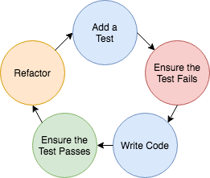

# **Test Driven Development (TDD)**

## Definition

Test-Driven Development (TDD) is a methodology in software development that focuses on an iterative development cycle where the emphasis is placed on writing test cases before the actual feature or function is written. TDD utilizes repetition of short development cycles. It combines building and testing.

TDD drives the design of software from the ‘outside-in’, and we end up with better encapsulation and modularity (aspects of clean code) making it easier to understand.  Just enough complexity should be added to make the code pass tests (simplicity). The resulting automated test suite can be run whenever we make a change so we get fast feedback to support confidence.  By sharing responsibility for test automation with the whole team supports repeatability.​

​TDD usually follows the "Red-Green-Refactor" cycle:

- Add a test to the test suite
- (Red) Run all the tests to ensure the new test fails
- (Green) Write just enough code to get that single test to pass
- Run all tests
- (Refactor) Improve the initial code while keeping the tests green
- Repeat

## How to achieve TDD

- The team uses Test Driven Development to build software that meets requirements, contains nothing more than necessary, has good modular design, and has high change confidence from automated test coverage.  ​
- No production code is written except to make a test pass.  ​
- The red-green-refactor cycle is used by the team.  ​
- Unit (fast) test coverage is maintained very high (>80%). ​
- The whole team owns the whole test suite, and automated tests are implemented as part of story scope by developers.

## How to measure outcomes of TDD

- **Escaped Defects:** The number of bugs that reach production, which is an important indicator of code quality. The goal of TDD is to reduce the number of bugs reaching production over time.
- **Cycle Time:** The amount of time that it takes a new story to move from open to complete/done. While TDD may initially increase cycle time due to the learning curve, the long-term benefit comes from fewer misunderstandings of features.
- **Planned vs. Unplanned:** The percentage of time spent on planned (e.g. feature development) versus unplanned work (e.g. troubleshooting bugs), which is a measure of project planning efficiency. BDD can help improve this efficiency.

## Crawl - Walk - Run

| Phase | Activity| Measure|
| ------ | ------- | ----- |
| **Crawl** | Write unit tests for all new code | Code Coverage for new code is high (>80%) |
| **Walk** | Follow TDD (Red-Green-Refactor) for most of the new code | Establish baseline for the metrics (above)  |
| **Run** |Follow TDD (Red-Green-Refactor) for most of the new code | Measure improvement on baseline metrics (number of prod defects, cycle time)|

## Useful resources

[testdriven.io](https://testdriven.io/)
[TDD with CyberDojo](https://medium.com/@Sriram23/tdd-with-cyber-dojo-1a1ce2324730)
