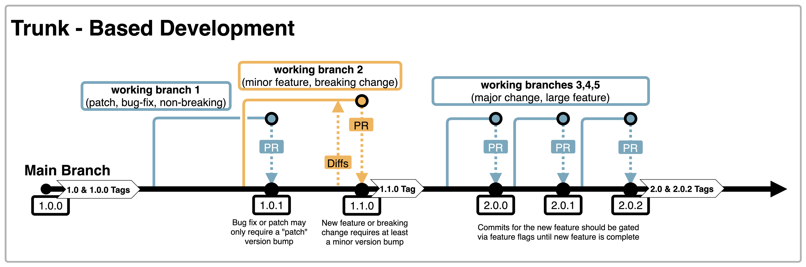

# **Trunk Based Development**

## Definition

Continuous delivery practices small-batch work with frequent merges to the main branch. This  **trunk-based development**  approach enables continuous integration and provides fast feedback. In this model, the approach to branching is simple, with an emphasis on integrating code to trunk as fast as possible to produce _production release candidate_.
  
>Trunk-based development is the practice of continuously merging code into the trunk and avoiding long-lived feature branches. This practice is considered a complement to continuous integration and has been shown for years to accelerate software delivery velocity. -- State of DevOps 2022

  `main` branch is the one, long-lived branch the represents the application. All commits on this branch should have successful builds and should be releasable at any moment. When working in a continuous delivery model, the team must agree to respect and protect main, and swarm when it fails.

Trunk-based Development in practice:

- Each team member integrates changes from their working copy to a single trunk/main branch multiple times per day.
- The trunk/main branch is kept in a production-deployable state, and the team knows how to safely merge work-in-progress
- Any development branch lives for hours only, never for days/weeks.

See [Dojo Portal](https://grainger-dojo-portal-dev.nonprod.graingercloud.com/#/catalogue/source-code-management/trunk-based-development) for a more in-depth definition (definition below is adopted heavily from the portal)

### How do I achieve Trunk-Based Development?

If you are moving from another branching strategy and not every engineer on a product team is comfortable the team should consider starting with short-lived working branches with the ultimate goal of striving toward pure trunk-based development.

#### Working Branches: short-lived, merge often

With working branches, commits are made on branches created off of the main branch and merged in through a pull request after a successful CI build validation. Following Ticket Based Engineering (TBE) principals, all development should correspond to tickets and integrated with an issue tracking software. Working branches should be short-lived (less than 1 day), exist for a single unit of work, and the branch removed/deleted after merging into main.

#### Pure Trunk-Based Development

For product teams with mature development practices, short-lived working branches can be omitted in favor of direct commits to main. Before moving to pure trunk-based development, there are some caveats that should be considered to reduce friction and promote stability:

- **Build validation**  comes locally through Git hooks (e.g. pre-commit or pre-push) instead of a branch build from the CI server. Extra tools will be required to make sure hooks are synced with the rest of the team (_ex: [husky](https://www.npmjs.com/package/husky)_).
- **Peer reviews**  come from structured pair programming instead of pull requests.
- **Feature Flags / Feature Toggles** are needed to ensure work can be merged frequently without having to keep changes stored on a developer's local machine until a feature is completely built out. By keeping features "dark" with flags, devs can merge in their work to the main line and continue iterating until the team is ready to enable the feature.

**What about releases branches?**  Release branches are generally discouraged in continuous delivery and should **only** happen if your organization does not support releasing on-demand. However, if parallel development must occur while the team prepares for a release, a short-lived branch can be cut for testing and bug fixes, and then removed once the team completes the release.

### How do I measure outcomes of Trunk-Based Development?

For **short-lived branches**

- **Branch Age:** Measure the life of a branch from creation date/time to current timestamp. Branches, other than main, should live less than 3 business days as an absolute maximum
- **Number of Active Branches:** Measure the number of active branches in your product team SCM system. The number should be visible to the entire team and monitored if the number is too high.
- **Pull Requests (PR) Age:** If code reviews are an asynchronous tasks, measure the average duration of time passed from the time a Pull Request is opened until it has been marked as Merged. A blameless retro should be conducted on the outliers on either end of the spectrum (fastest and longest) on a regular basis.

For **pure Trunk-Based Development**

- **Frequency of commits to main branch:** Measure the percentage or number of branches merged to master each day relative to the size of the team

### Crawl - Walk - Run

| Phase | Activity| Measure|
| ------ | ------- | ----- |
| **Crawl** | Fully embrace short-lived branches and merge often for some if not most code changes | Branch age: 1-3 days   PR age: 1 day |
| **Walk** | Start with pure Trunk-Based Development | Commit to main branch daily |
| **Run** | Fully embrace pure Trunk-Based Development | Commit to main branch multiple times a day|
